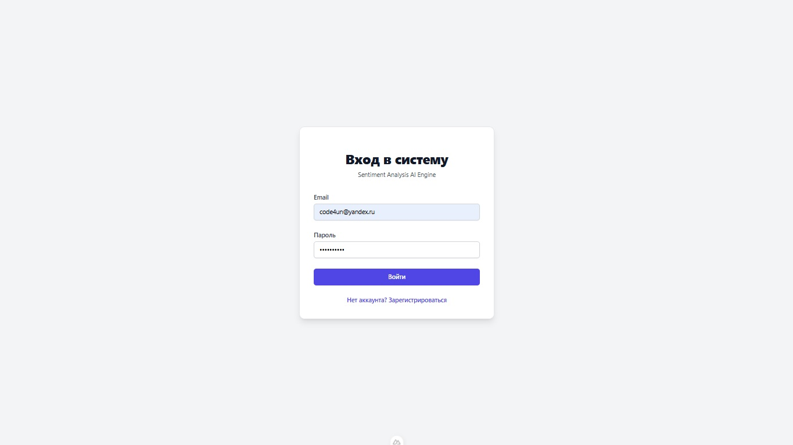
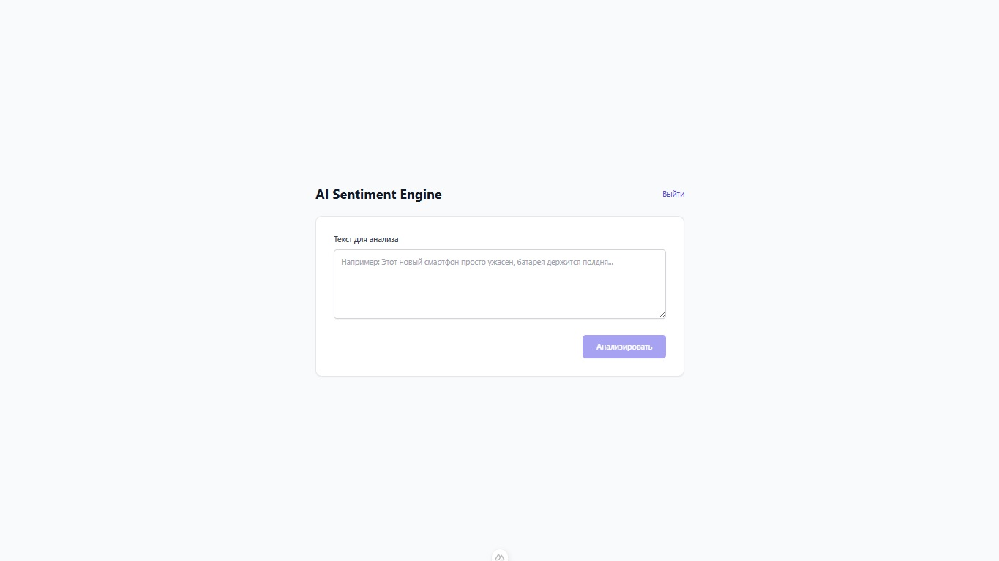
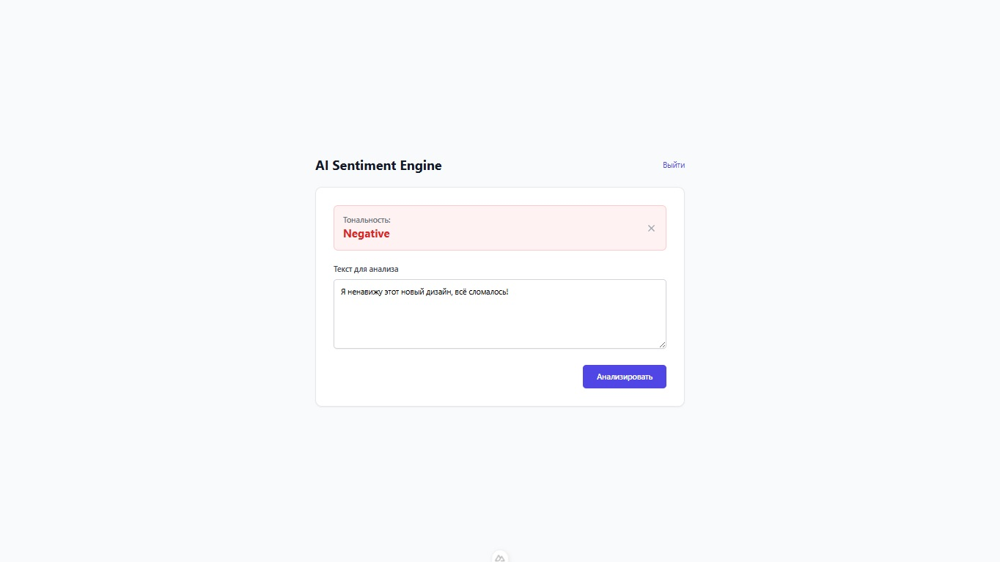
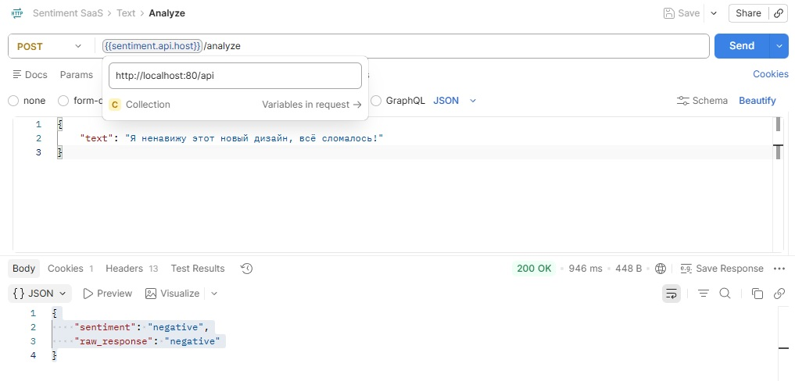
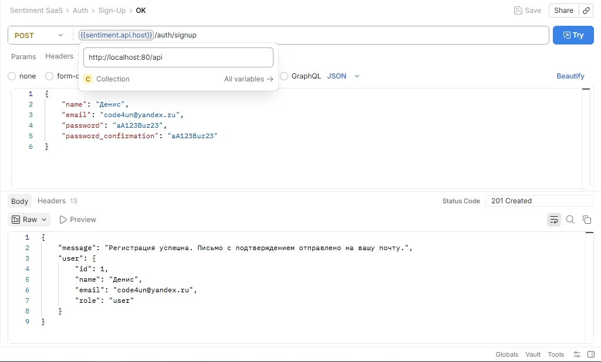

# Laravel Sentiment Engine 🧠
Runs sentiment analysis on your text data


## 📸 Скриншоты

### Интерфейс аутентификации


### Главный интерфейс


### Результат анализа


### Примеры API запросов



## Hardware Requirements 🛠
* x64 CPU
* 16 GB RAM for running local LLM, 2 GB for lightweight version
* 16 GB storage, to handle DB and local LLM

## Software Requirements 🛠
* Docker

## Start 🚀

Project has 2 modes:
* Standalone - using local LLM
* Lightweight - using third-party OpenAI API compatible LLM provider

### Standalone version
Disclaimer: Step #4 may fail, if your Docker Engine has limit for storage. Recommended is 4 GB file storage limit.
1. Create `.env.standalone` from template `.env.standalone.template`
2. Fill credentials
3. Run the following command to start the project with local LLM:
    ```sh
    docker compose --env-file .env.standalone -f standalone.compose.yml up -d --build
    ```
4. Check if LLM is running:
   ```sh
   docker compose --env-file .env.standalone -f standalone.compose.yml logs -f ollama
   ```
   Or
   ```sh
   docker logs -f sentiment-ollama
   ```

### Lightweight version for low resource machines
1. Create `.env.light` from template `.env.light.template`
2. Fill credentials
3. To run lightweight version, using third-party LLM via any OpenAI API compatible provider, run:
   ```sh
   docker compose --env-file .env.light -f light.compose.yml up -d --build
   ```

## Test API
   ```sh
   curl -X POST http://localhost:8080/api/sentiment \
     -H "Content-Type: application/json" \
     -d '{"text": "Этот сервис просто потрясающий, все работает быстро!"}'
   ```

## Stop
   ```sh
   docker compose compose --env-file .env.standalone -f standalone.compose.yml down
   ```

## API Documentation (Swagger) 📜
The project includes interactive API documentation powered by Swagger (OpenAPI). The documentation is automatically generated every time the PHP container starts.

### Accessing the Documentation:
Once the containers are running, open the following URL in your browser:
👉 http://localhost:80/api/documentation
Manual Generation
If you modify API controllers or Swagger annotations and want to update the documentation immediately without restarting the container, run:
```sh
docker compose --env-file .env.standalone -f standalone.compose.yml exec php artisan l5-swagger:generate
```